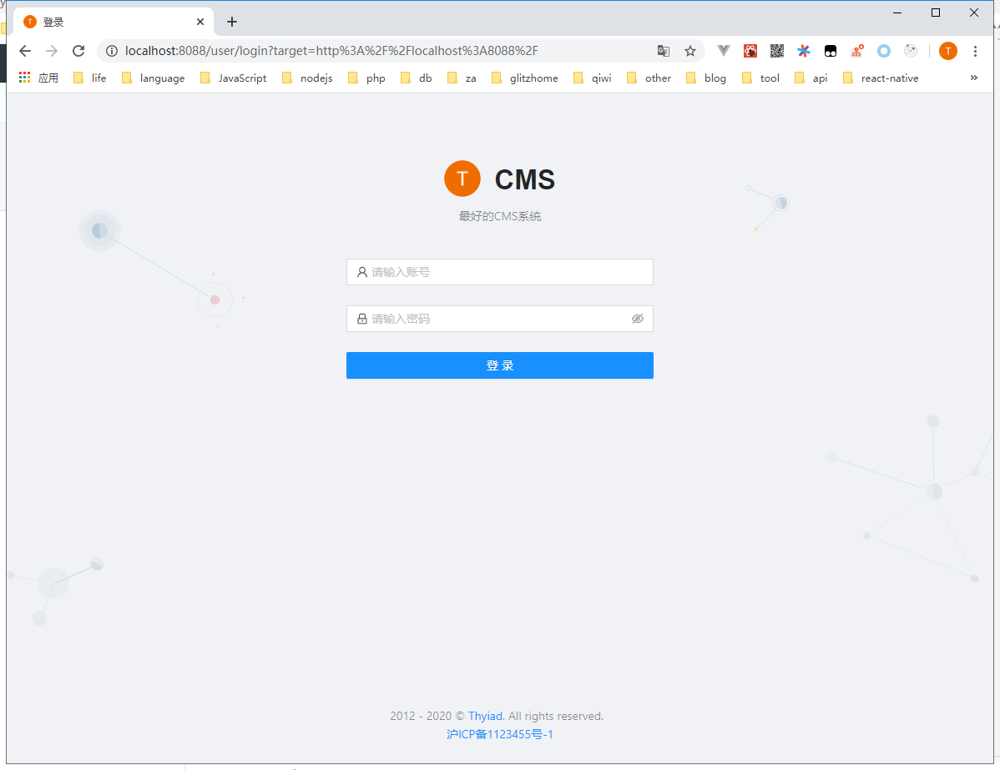

### 注意

使用修改点：

-   windows 下配置 autocrlf 为 false
    ```bash
    git config --global core.autocrlf false
    ```
    > 否则会自动把换行符 LF(linefeed character) 转换成回车符 CRLF(carriage-return character)
-   constant/index.ts
    > 采用 cookie 存储 token 到上级域名，在这个文件中修改 cookie key 及登录页面的 url
-   constant/systemInfo.ts
    > 页面常量在此处修改，比如系统名称、著作权等等
-   开启 rem 需要放开注释
    > webpack/module-rules.js 的 pix2rem
    > webpack/index.html 中 rem 的 script 节点
    > server/config.ts 中的 useRem

### 提交规范

```
'build', // 构建
'ci', // ci
'chore', // Other changes that don't modify src or test files. 改变构建流程、或者增加依赖库、工具等
'docs', // Adds or alters documentation. 仅仅修改了文档，比如README, CHANGELOG, CONTRIBUTE等等
'feat', // Adds a new feature. 新增feature
'fix', // Solves a bug. 修复bug
'perf', // Improves performance. 优化相关，比如提升性能、体验
'refactor', // Rewrites code without feature, performance or bug changes. 代码重构，没有加新功能或者修复bug
'revert', // Reverts a previous commit. 回滚到上一个版本
'style', // Improves formatting, white-space. 仅仅修改了空格、格式缩进、逗号等等，不改变代码逻辑
'test' // Adds or modifies tests. 测试用例，包括单元测试、集成测试等
```

### 已完成

-   [x] 集成 antd
-   [x] husky、quick prettie、commitlint 验证提交
-   [x] utils 工具类封装
-   [x] 基础布局封装
    > 左侧菜单布局、顶部菜单布局、注册/登录布局
-   [x] 权限控制
-   [x] 集成 ant design pro table
-   [x] thyReq 允许自定义 axios 回调
-   [ ] stylus、vue 支持
    > 等 vue3 release 再考虑，到时候再集成一个默认的 vue ui
-   [ ] fluent ui
    > 看着风格挺好的，接口设计也挺好的，还 css in js，奈何组件太弱了，需要自行完善很多：
    -   [x] toast 静态调用（基于 MessageBar 封装）
    -   [ ] alert、confirm 静态调用（基于 Modal 封装）
    -   [ ] 表格：分页组件（无）、过滤搜索区域（）
    -   [ ] 表单：form 组件（无）、form 自动验证（无）
    -   [ ] 默认没有栅格栏，需要导入 Fabric Core
    -   [ ] 重写 login 页面
    -   [ ] 重写 leftMenuLayout
    -   [ ] 重写 topMenuLayout

### ssr

-   [x] server 端获取页面初始数据
-   [x] 注入初始 store 数据
-   [x] server 端有修改时，如何自动刷新页面
        除非开发时 socket 通知，但仅仅为了自动刷新，没必要
-   [x] 使用 nodemon，有时候端口不会被释放
        已改为 spawn+kill('SIGINT') 的方式

### husky 6.0

husky6 必须安装在根目录下

```bash
npm install husky --save-dev
npx husky install   # 如果要安装到子目录中，需要  husky install frontend/.husky
npm set-script prepare "husky install"  # 如果是子目录，需要在子目录中运行： npm set-script prepare "cd .. && husky install frontend/.husky"
npx husky add .husky/pre-commit "npx --no-install pretty-quick --staged" # 如果是子目录，需要在具体命令前加上 cd frontend，比如.husky/pre-commit
npx husky add .husky/commit-msg "npx --no-install commitlint --edit $1"
```

### chalk

-   chalk 暂保持在 4.0，[原因](https://github.com/chalk/chalk/releases/tag/v5.0.0)：
    > This package is now pure ESM. Please [read this](https://gist.github.com/sindresorhus/a39789f98801d908bbc7ff3ecc99d99c).
    > If you use TypeScript, you will want to stay on Chalk 4 until TypeScript 4.6 is out. [Why](https://github.com/microsoft/TypeScript/issues/46452).
-   同上，clean-webpack-plugin 也暂保持在 3.0
-   react-router-v6 改动有点大，有些系统还用了微服务，这里暂不做升级
    > 官方升级指南：https://reactrouter.com/docs/en/v6/upgrading/v5#introduction

### 预览




### 升级到 antd5.0+react-router-6.0

-   [x] 先升级 webpack 等依赖库到最新版本
-   [ ] 升级 react 到 18
-   [ ] 升级到 antd5
-   [ ] 升级 react-router 到 6.0
